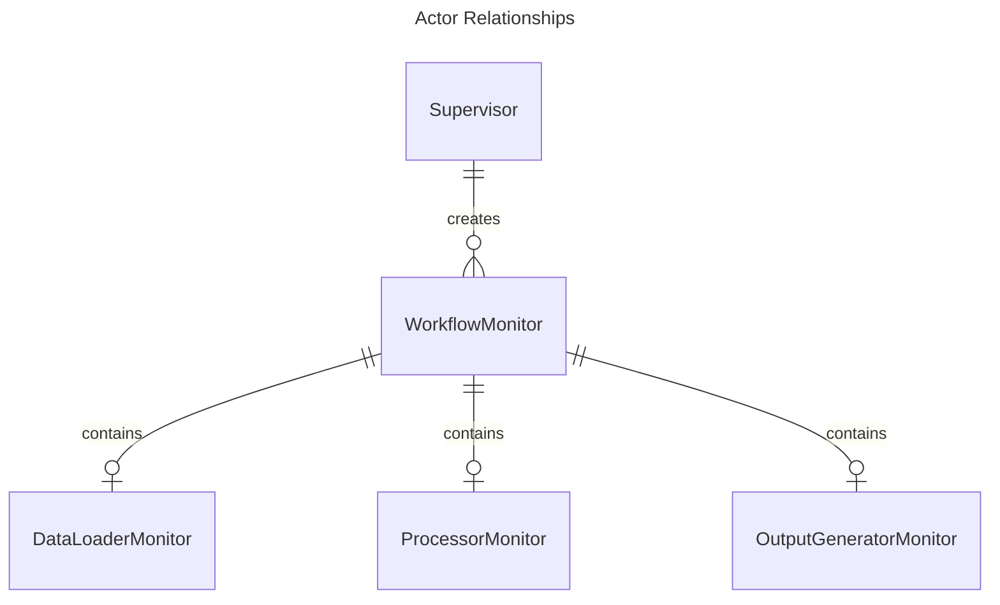

```mermaid
---
title: Actor Relationships
---
erDiagram
    Supervisor ||--o{ WorkflowMonitor : creates
    WorkflowMonitor ||--o| DataLoaderMonitor : contains
    WorkflowMonitor ||--o| ProcessorMonitor : contains
    WorkflowMonitor ||--o| OutputGeneratorMonitor : contains
```
